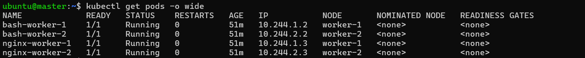
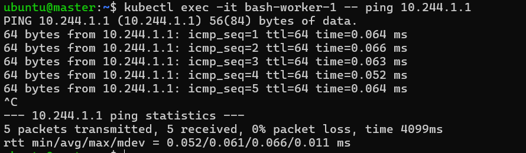

# Custom Kubernetes CNI Plug-in Setup with Bash

## Introduction
Kubernetes networking enables seamless communication between pods across different nodes. Implementing a custom CNI (Container Network Interface) plug-in helps in understanding and controlling the network model. This document guides you through creating and configuring a custom CNI plug-in using Bash.

## Steps to Setup Kubernetes CNI Plug-in

### 1. Create and Configure VMs
Create three VMs (master, worker-1, worker-2). SSH into each VM and execute the following commands:

```bash
# Update and install required packages
sudo apt-get update
sudo apt-get install -y docker.io apt-transport-https curl jq nmap iproute2

# Add Kubernetes APT repository and install Kubernetes components
curl -fsSL https://pkgs.k8s.io/core:/stable:/v1.31/deb/Release.key | sudo gpg --dearmor -o /etc/apt/keyrings/kubernetes-apt-keyring.gpg
echo 'deb [signed-by=/etc/apt/keyrings/kubernetes-apt-keyring.gpg] https://pkgs.k8s.io/core:/stable:/v1.31/deb/ /' | sudo tee /etc/apt/sources.list.d/kubernetes.list
sudo apt-get update
sudo apt-get install -y kubelet kubeadm kubectl
```

### 2. Initialize Kubernetes Cluster

On the master node, initialize the Kubernetes cluster:

```bash
sudo kubeadm init --pod-network-cidr=10.244.0.0/16
```

Configure `kubectl` for non-root user:

```bash
mkdir -p $HOME/.kube
sudo cp -i /etc/kubernetes/admin.conf $HOME/.kube/config
sudo chown $(id -u):$(id -g) $HOME/.kube/config
```

Join worker nodes to the cluster using the join token provided by the `kubeadm init` command.

### 3. Deploy Pod Network

Create and apply the CNI plug-in configuration:

```bash
sudo nano /etc/cni/net.d/10-bash-cni-plugin.conf
```

Add the following content:

```json
{
    "cniVersion": "0.3.1",
    "name": "mynet",
    "type": "bash-cni",
    "network": "10.244.0.0/16",
    "subnet": "<node-cidr-range>"
}
```

Replace `<node-cidr-range>` with:

- `10.244.0.0/24` for the master
- `10.244.1.0/24` for worker-1
- `10.244.2.0/24` for worker-2

Create the network bridge:

```bash
sudo brctl addbr cni0
sudo ip link set cni0 up
sudo ip addr add <bridge-ip>/24 dev cni0
```

Replace `<bridge-ip>` with:

- `10.244.0.1` for the master
- `10.244.1.1` for worker-1
- `10.244.2.1` for worker-2

### 4. Create the CNI Plug-in

Save the CNI plug-in script as `/opt/cni/bin/bash-cni-plugin` on both master and worker nodes:

```bash
sudo nano /opt/cni/bin/bash-cni
```

Add the following script:

```bash
#!/bin/bash -e

if [[ ${DEBUG} -gt 0 ]]; then set -x; fi

exec 3>&1 # make stdout available as fd 3 for the result
exec &>> /var/log/bash-cni-plugin.log

IP_STORE=/tmp/reserved_ips # all reserved ips will be stored there

echo "CNI command: $CNI_COMMAND"

stdin=$(cat /dev/stdin)
echo "stdin: $stdin"

allocate_ip(){
    for ip in "${all_ips[@]}"
    do
        reserved=false
        for reserved_ip in "${reserved_ips[@]}"
        do
            if [ "$ip" = "$reserved_ip" ]; then
                reserved=true
                break
            fi
        done
        if [ "$reserved" = false ] ; then
            echo "$ip" >> $IP_STORE
            echo "$ip"
            return
        fi
    done
}

case $CNI_COMMAND in
ADD)
    network=$(echo "$stdin" | jq -r ".network")
    subnet=$(echo "$stdin" | jq -r ".subnet")
    subnet_mask_size=$(echo $subnet | awk -F  "/" '{print $2}')

    # List all IPs using seq to generate IPs based on CIDR
    base_ip=$(echo "$subnet" | awk -F '/' '{print $1}' | awk -F '.' '{print $1"."$2"."$3}')
    all_ips=($(seq -f "$base_ip.%g" 2 254))

    gw_ip="$base_ip.1"
    reserved_ips=$(cat $IP_STORE 2> /dev/null || printf "$base_ip.0\n$gw_ip\n") # reserving .0 and .1
    reserved_ips=(${reserved_ips[@]})
    printf '%s\n' "${reserved_ips[@]}" > $IP_STORE
    container_ip=$(allocate_ip)

    mkdir -p /var/run/netns/
    ln -sfT $CNI_NETNS /var/run/netns/$CNI_CONTAINERID

    rand=$(tr -dc 'A-F0-9' < /dev/urandom | head -c4)
    host_if_name="veth$rand"
    ip link add $CNI_IFNAME type veth peer name $host_if_name

    ip link set $host_if_name up
    ip link set $host_if_name master cni0

    ip link set $CNI_IFNAME netns $CNI_CONTAINERID
    ip netns exec $CNI_CONTAINERID ip link set $CNI_IFNAME up
    ip netns exec $CNI_CONTAINERID ip addr add $container_ip/$subnet_mask_size dev $CNI_IFNAME
    ip netns exec $CNI_CONTAINERID ip route add default via $gw_ip dev $CNI_IFNAME

    mac=$(ip netns exec $CNI_CONTAINERID ip link show $CNI_IFNAME | awk '/ether/ {print $2}')
    echo "{
      \"cniVersion\": \"0.3.1\",
      \"interfaces\": [                                            
          {
              \"name\": \"$CNI_IFNAME\",
              \"mac\": \"$mac\",                            
              \"sandbox\": \"$CNI_NETNS\" 
          }
      ],
      \"ips\": [
          {
              \"version\": \"4\",
              \"address\": \"$container_ip/$subnet_mask_size\",
              \"gateway\": \"$gw_ip\",          
              \"interface\": 0 
          }
      ]
    }" >&3

;;

DEL)
    ip=$(ip netns exec $CNI_CONTAINERID ip addr show $CNI_IFNAME | awk '/inet / {print $2}' | sed s%/.*%% || echo "")
    if [ ! -z "$ip" ]
    then
        sed -i "/$ip/d" $IP_STORE
    fi
;;

GET)
    echo "GET not supported"
    exit 1
;;

VERSION)
    echo '{
      "cniVersion": "0.3.1", 
      "supportedVersions": [ "0.3.0", "0.3.1", "0.4.0" ] 
    }' >&3
;;

*)
  echo "Unknown CNI command: $CNI_COMMAND"
  exit 1
;;

esac
```

Make the script executable:

```bash
sudo chmod +x /opt/cni/bin/bash-cni
```

### 5. Deploy Pods for Testing

Create a sample deployment to test your setup:

```yaml
apiVersion: v1
kind: Pod
metadata:
  name: nginx-worker-1
spec:
  containers:
  - name: nginx
    image: nginx
    ports:
    - containerPort: 80
  nodeSelector:
    kubernetes.io/hostname: worker-1
---
apiVersion: v1
kind: Pod
metadata:
  name: bash-worker-1
spec:
  containers:
  - name: ubuntu
    image: smatyukevich/ubuntu-net-utils
    command:
      - "/bin/bash"
      - "-c"
      - "sleep 10000"
  nodeSelector:
    kubernetes.io/hostname: worker-1
---
apiVersion: v1
kind: Pod
metadata:
  name: nginx-worker-2
spec:
  containers:
  - name: nginx
    image: nginx
    ports:
    - containerPort: 80
  nodeSelector:
    kubernetes.io/hostname: worker-2
---
apiVersion: v1
kind: Pod
metadata:
  name: bash-worker-2
spec:
  containers:
  - name: ubuntu
    image: smatyukevich/ubuntu-net-utils
    command:
      - "/bin/bash"
      - "-c"
      - "sleep 10000"
  nodeSelector:
    kubernetes.io/hostname: worker-2
```

Save this YAML file as `nginx-deployment.yaml` and apply it:

```bash
kubectl apply -f deploy.yaml
```

Verify that the pods are running:

```bash
kubectl get pods
```



### Checking Connectivity

1. **Check Pod Connectivity**:

   After applying the above setup, you might notice that pods can ping the host but not other containers or external addresses.

   ```bash
   kubectl exec -it bash-worker-1 -- bash
   ```

   Inside the pod, try pinging the host, other containers, and an external address like Google. Only the host ping will succeed.
```bash
ping 10.244.1.1 # can ping own host 
```



2. **Fix Internal Pod Communication**:

   Run these commands on both master and worker nodes:

   ```bash
   sudo iptables -t filter -A FORWARD -s 10.244.0.0/16 -j ACCEPT
   sudo iptables -t filter -A FORWARD -d 10.244.0.0/16 -j ACCEPT
   ```

   we can ping other container in the same node

3. **Fix External Access**:

   - On the master node:

     ```bash
     sudo iptables -t nat -A POSTROUTING -s 10.244.0.0/24 ! -o cni0 -j MASQUERADE
     ```

   - On the worker nodes:

     ```bash
     sudo iptables -t nat -A POSTROUTING -s 10.244.1.0/24 ! -o cni0 -j MASQUERADE  # worker-1
     sudo iptables -t nat -A POSTROUTING -s 10.244.2.0/24 ! -o cni0 -j MASQUERADE  # worker-2
     ```
    External ping also working

